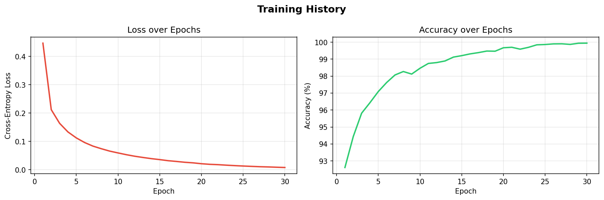
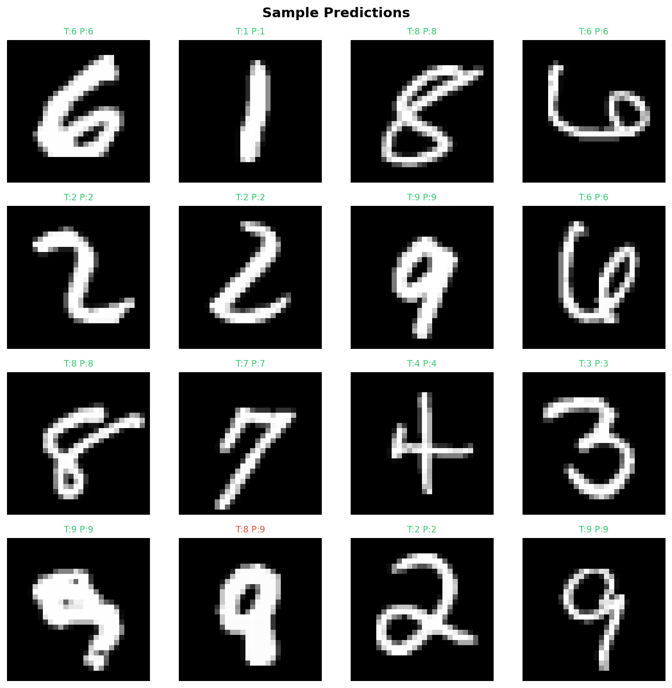

# 🧠 Neural Network from Scratch

A fully connected feedforward neural network implemented **using only NumPy** — no PyTorch, no TensorFlow, no Keras.

Built to deeply understand the math behind deep learning: forward propagation, backpropagation, gradient descent, and more.

---

## 📊 Results on MNIST

| Metric         | Value     |
|----------------|-----------|
| Test Accuracy  | ~97%      |
| Training Time  | ~2 min    |
| Parameters     | ~118K     |
| Framework      | NumPy only |




---

## 🏗️ Architecture

```
Input (784)  →  Hidden (128, ReLU)  →  Hidden (64, ReLU)  →  Output (10, Softmax)
```

### Key Concepts Implemented

| Concept | Details |
|---|---|
| **Weight Init** | He initialization (ReLU), Xavier (others) |
| **Activations** | ReLU, Sigmoid, Softmax |
| **Loss** | Cross-Entropy |
| **Optimizer** | Mini-batch Stochastic Gradient Descent |
| **Backprop** | Fully derived and implemented from scratch |

---

## 📁 Project Structure

```
neural-network-from-scratch/
│
├── src/
│   ├── neural_network.py   # Core NN class (forward, backward, train, predict)
│   ├── data_utils.py       # MNIST loader + preprocessing utilities
│   └── visualize.py        # Training curves, confusion matrix, predictions
│
├── tests/
│   └── test_neural_network.py  # Unit tests (pytest)
│
├── outputs/                # Generated plots saved here
├── train.py                # Main training script
├── requirements.txt
└── README.md
```

---

## 🚀 Getting Started

### 1. Clone the repo

```bash
git clone https://github.com/ajithhraj/neural-network-from-scratch.git
cd neural-network-from-scratch
```

### 2. Install dependencies

```bash
pip install -r requirements.txt
```

### 3. Train the model

```bash
python train.py
```

### 4. Custom training options

```bash
# Custom architecture and hyperparameters
python train.py --epochs 50 --lr 0.01 --batch_size 128 --hidden 256 128 64
```

| Argument       | Default | Description                        |
|----------------|---------|------------------------------------|
| `--epochs`     | 30      | Number of training epochs          |
| `--lr`         | 0.05    | Learning rate                      |
| `--batch_size` | 64      | Mini-batch size                    |
| `--hidden`     | 128 64  | Hidden layer sizes                 |
| `--save_model` | model   | Filename to save weights (.npz)    |
| `--no_plot`    | False   | Skip saving output plots           |

---

## 🧮 The Math

### Forward Propagation

For each layer $l$:

$$Z^{[l]} = W^{[l]} A^{[l-1]} + b^{[l]}$$

$$A^{[l]} = g^{[l]}(Z^{[l]})$$

### Cross-Entropy Loss

$$\mathcal{L} = -\frac{1}{m} \sum_{i=1}^{m} \sum_{k=1}^{K} y_k^{(i)} \log(\hat{y}_k^{(i)})$$

### Backpropagation (Chain Rule)

$$dZ^{[l]} = dA^{[l]} \odot g'^{[l]}(Z^{[l]})$$

$$dW^{[l]} = \frac{1}{m} dZ^{[l]} A^{[l-1]T}$$

$$dA^{[l-1]} = W^{[l]T} dZ^{[l]}$$

---

## ✅ Run Tests

```bash
pytest tests/ -v
```

---

## 📚 What I Learned

- How **backpropagation** works mathematically, not just conceptually
- Why **weight initialization** (He vs Xavier) matters for training stability
- How **mini-batch gradient descent** balances speed and convergence
- The role of **softmax + cross-entropy** in multi-class classification

---

## 🛠️ Future Improvements

- [ ] Add momentum / Adam optimizer
- [ ] Add dropout regularization
- [ ] Extend to support CNN layers
- [ ] Train on IMDB sentiment dataset (NLP)

---

## 👤 Author

**Ajith Raj** — [@ajithhraj](https://github.com/ajithhraj)

Built as part of preparation for **Google Summer of Code 2026**.

---

## 📄 License

MIT License — feel free to use, fork, and learn from this!
